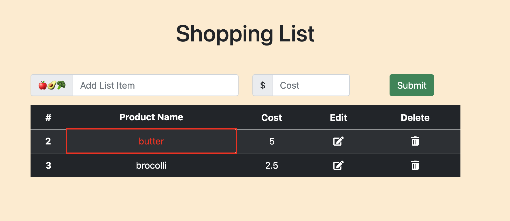
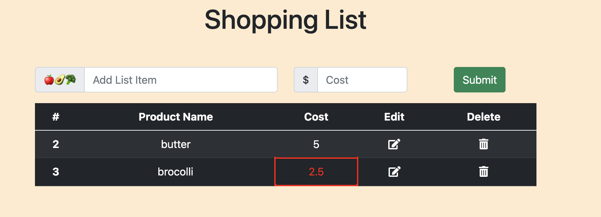

# Shopping-List-API-Express

Shopping list using Express.js Framework




Shopping List is a JS application for adding/editing/deleting items from the shopping list.

## Installation

First initialize npm package -- npm init

Use npm install to install shopping list app.

```bash
npm install
```

## Usage

Application is a simple front-backend application 
It can be tested by using Postman and jest for integration testing.  
To run application:
```js
npm server.js
```
or
```js
nodemon server.js
```

Run detailed integration tests for routes:
```
jest --coverage
```
Run a regular integration tests for routes:
```
jest -i
```

## Technologies Used

> Bootstrap    
> Express and Node   
> PostgreSQL  


## Contributing
Pull requests are welcome. For major changes, please open an issue first to discuss what you would like to change.

Please make sure to update tests as appropriate.

## License
[MIT](https://choosealicense.com/licenses/mit/)
